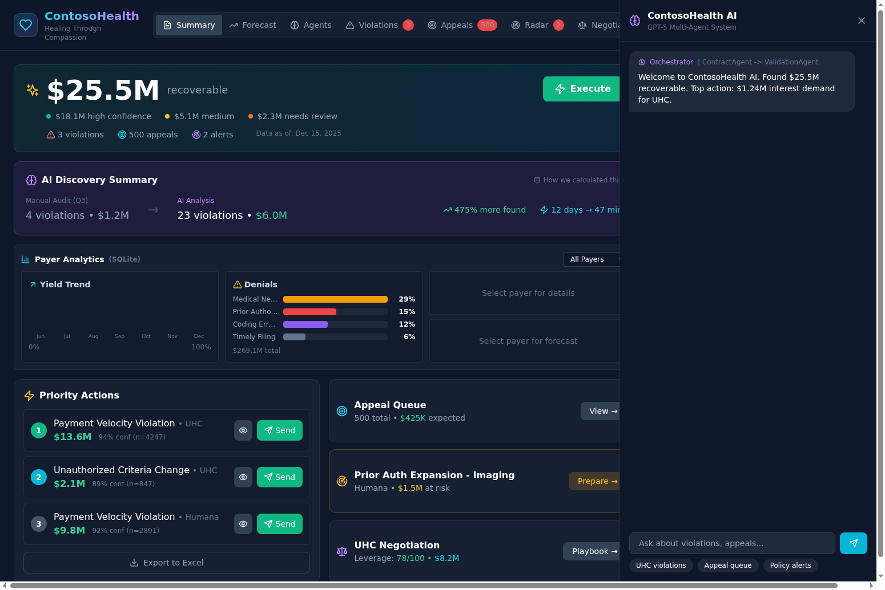
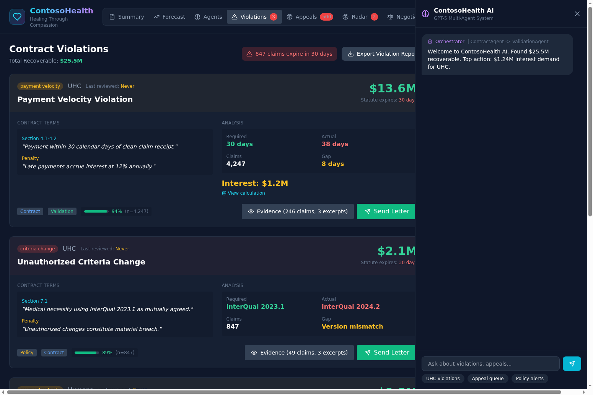
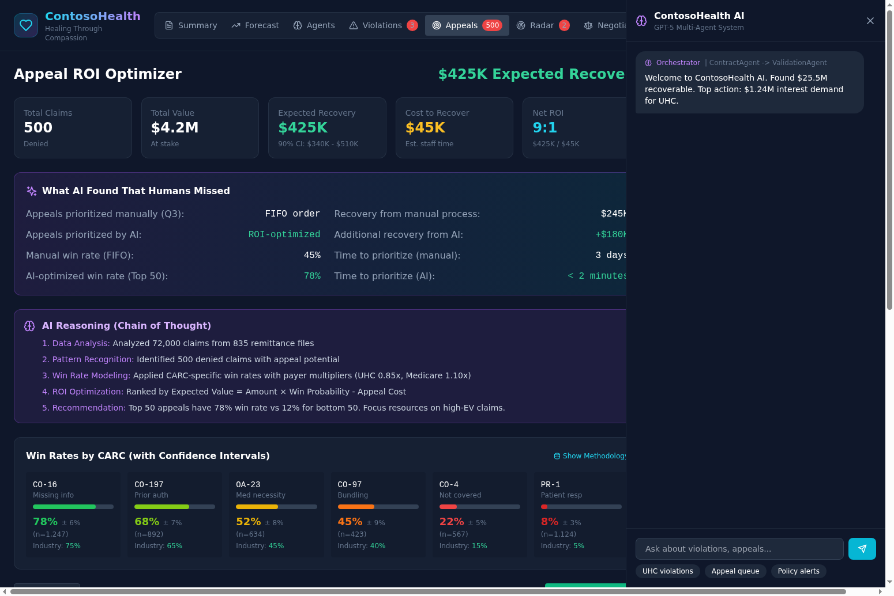
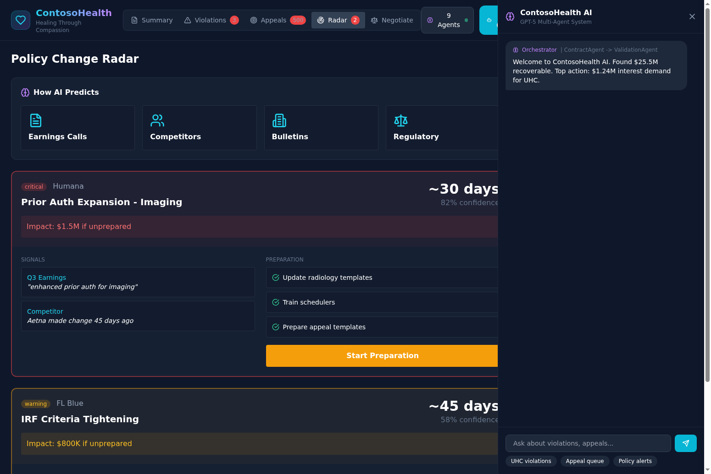
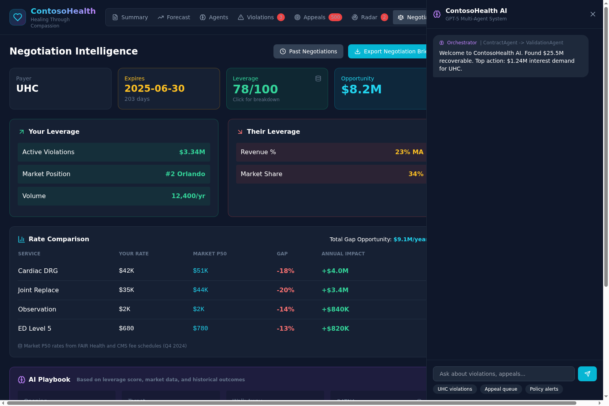

# ContosoHealth CFO Payer Response Platform

A comprehensive healthcare revenue cycle management platform that helps providers identify contract violations, optimize appeals, predict policy changes, and negotiate better payer contracts.

## Overview

The CFO Payer Response Platform is designed for healthcare CFOs and revenue cycle teams to maximize revenue recovery from commercial and government payers. The platform combines real-time claims data analysis with AI-powered insights to identify actionable opportunities worth millions in recoverable revenue.

### Key Capabilities

The platform provides healthcare providers with tools to manage payer relationships across six major insurers: UHC, Humana, BCBS (FL Blue), Aetna, Cigna, and Medicare. It analyzes 835/837 claims data stored in SQLite to surface contract violations, denial patterns, and negotiation leverage in real-time.

## Features

### Executive Summary Dashboard

The main dashboard provides a consolidated view of all recoverable revenue opportunities. The top banner shows total recoverable amount ($25.5M in the demo), along with counts of active violations, pending appeals, and policy alerts requiring attention.



The Payer Analytics section displays dynamic charts that update based on payer selection. When you select a specific payer from the dropdown, all four panels update to show payer-specific data:

- **Yield Trend**: 6-month visualization of payment yield percentage with color-coded bars (red indicates months below 70% yield)
- **Denials**: Horizontal bar chart showing denial breakdown by category (Medical Necessity, Prior Authorization, Coding Errors, Timely Filing) with percentages and total denied amount
- **Payer Summary**: Key metrics including annual revenue, yield gap percentage, and risk tier classification (Critical, Elevated, or Normal)
- **Cash Forecast**: Projected vs actual cash collections comparison for the selected payer

The Priority Actions section lists the top contract violations ranked by recoverable amount, with one-click access to send demand letters.

### Contract Violations

The Violations tab provides detailed analysis of each identified contract breach with supporting evidence and recommended actions.



Each violation card includes:

- **Contract Terms**: Specific contract sections being violated with exact language quoted
- **Analysis**: Side-by-side comparison of required vs actual performance (e.g., 30-day payment requirement vs 38-day actual)
- **Financial Impact**: Principal amount plus calculated interest based on contract penalty terms
- **Confidence Score**: AI-generated confidence level based on contract language matching and claims data validation
- **Actions**: Buttons to view supporting evidence or generate and send a formal demand letter

The platform currently tracks three types of violations: Payment Velocity (late payments), Unauthorized Criteria Changes (using different medical necessity criteria than contracted), and Underpayment patterns.

### Appeal ROI Optimizer

The Appeals tab uses machine learning to prioritize denied claims by expected recovery value rather than simple FIFO processing.



Key features include:

- **Win Rate Analysis**: Historical win rates broken down by CARC code (CO-16 Missing Info at 78%, CO-197 Prior Auth at 68%, etc.)
- **RL Optimizer**: Reinforcement learning model that identifies the top 50 appeals with 78% win rate vs 45% for FIFO processing, representing $180K improvement
- **Prioritized Queue**: Claims ranked by expected value (Amount x Win Probability) with individual appeal buttons
- **Bulk Actions**: One-click bulk appeal for top performers or bulk write-off for low-probability claims
- **Payer Filter**: Filter the queue by specific payer to focus efforts

The table shows claim details including claim ID, payer, CARC code, amount, win probability, expected value, and days since denial.

### Policy Change Radar

The Radar tab uses AI to predict upcoming payer policy changes before they take effect, giving providers time to prepare.



The prediction system monitors four signal sources:

- **Earnings Calls**: Natural language processing of payer quarterly earnings transcripts
- **Competitors**: Tracking when other payers implement similar changes
- **Bulletins**: Monitoring payer provider bulletins and policy updates
- **Regulatory**: CMS and state regulatory filings

Each predicted change shows:

- **Timeline**: Estimated days until implementation
- **Confidence**: AI confidence level in the prediction
- **Impact**: Estimated financial impact if unprepared
- **Signals**: Specific evidence supporting the prediction
- **Preparation Checklist**: Recommended actions to mitigate impact

### Negotiation Intelligence

The Negotiate tab provides data-driven insights for contract renewal negotiations.



The negotiation dashboard includes:

- **Contract Overview**: Current payer, expiration date, days remaining, leverage score, and opportunity value
- **Your Leverage**: Active violations amount, market position ranking, and annual claim volume
- **Their Leverage**: Revenue dependency percentage and market share
- **Rate Comparison**: Table comparing your rates to market P50 benchmarks with gap percentages
- **AI Playbook**: Recommended opening position, target, walk-away point, and BATNA (Best Alternative to Negotiated Agreement)

### AI Chat Assistant

The platform includes a GPT-5 powered chat assistant that can answer questions about violations, appeals, policy changes, and provide strategic recommendations. The chat panel is accessible from any tab and maintains context about the current view.

The AI system uses a multi-agent architecture with specialized agents for different domains (Contract Analysis, Appeals Strategy, Policy Prediction, Negotiation Support) orchestrated by a central routing agent that selects the best agent for each query.

## Technical Architecture

### Frontend

The frontend is built with React and TypeScript, using Tailwind CSS for styling. Key technologies include:

- React 18 with functional components and hooks
- Tailwind CSS for responsive dark-themed UI
- Lucide React for iconography
- Vite for build tooling

### Backend

The backend is a FastAPI application deployed on Fly.io. It provides REST APIs for:

- Payer data and analytics (`/api/payers`, `/api/analysis/payer/{id}`)
- Contract violations and demand letters (`/api/warfare/violations`)
- Appeal queue and optimization (`/api/warfare/appeals`)
- Policy radar alerts (`/api/warfare/radar`)
- Negotiation intelligence (`/api/warfare/negotiation`)
- AI chat with multi-agent orchestration (`/api/warfare/chat`)

### Database

Claims data is stored in SQLite with approximately 72,000 synthetic 835/837 claims records. The database includes tables for:

- Claims (837 submissions and 835 remittances)
- Payer contracts and terms
- Denial codes and categories
- Policy documents for RAG
- Cash forecast projections

### AI Integration

The platform integrates with Azure OpenAI using GPT-5 for:

- Chat responses with chain-of-thought reasoning
- Demand letter generation
- Policy change prediction
- Negotiation strategy recommendations

A knowledge graph built with NetworkX stores payer policies, contract terms, and regulatory requirements for GraphRAG-enhanced responses.

## Deployment

### Local Development

To run the frontend locally:

```bash
cd cfo-frontend
npm install
npm run dev
```

To run the backend locally:

```bash
cd backend
poetry install
poetry run uvicorn app.main:app --reload
```

### Environment Variables

The backend requires the following environment variables:

```
AZURE_OPENAI_ENDPOINT=<your-endpoint>
AZURE_OPENAI_API_KEY=<your-key>
AZURE_OPENAI_DEPLOYMENT=gpt-5
```

## Data Model

### Payers

The platform tracks six major payers with the following attributes:

| Payer | Type | Annual Revenue | Risk Tier |
|-------|------|----------------|-----------|
| UHC MA | Medicare Advantage | $856.8M | Critical |
| Humana MA | Medicare Advantage | $623.4M | High |
| FL Blue | Commercial | $712.3M | Elevated |
| Aetna | Commercial | $445.2M | Moderate |
| Cigna | Commercial | $334.1M | Normal |
| Medicare | Government | $892.5M | Normal |

### Denial Categories

Claims are categorized by CARC code with historical win rates:

| CARC | Category | Win Rate |
|------|----------|----------|
| CO-16 | Missing Information | 78% |
| CO-197 | Prior Authorization | 68% |
| OA-23 | Medical Necessity | 52% |
| CO-97 | Bundling | 45% |
| CO-4 | Not Covered | 22% |
| PR-1 | Patient Responsibility | 8% |

## Contributing

This project is maintained by Gregory Katz. For questions or contributions, please open an issue or pull request on GitHub.

## License

Proprietary - ContosoHealth Internal Use Only
