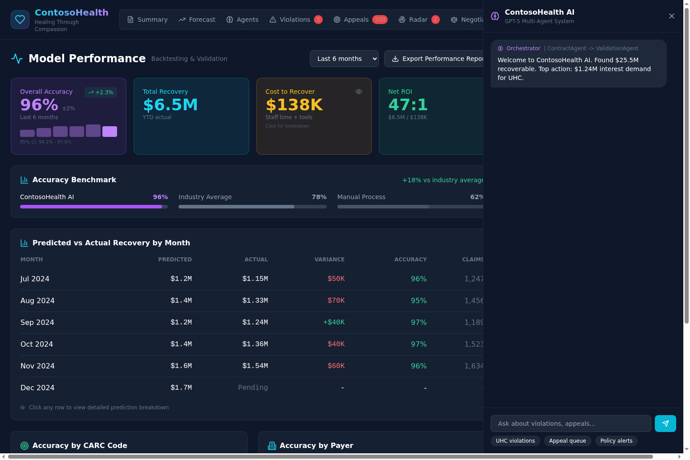
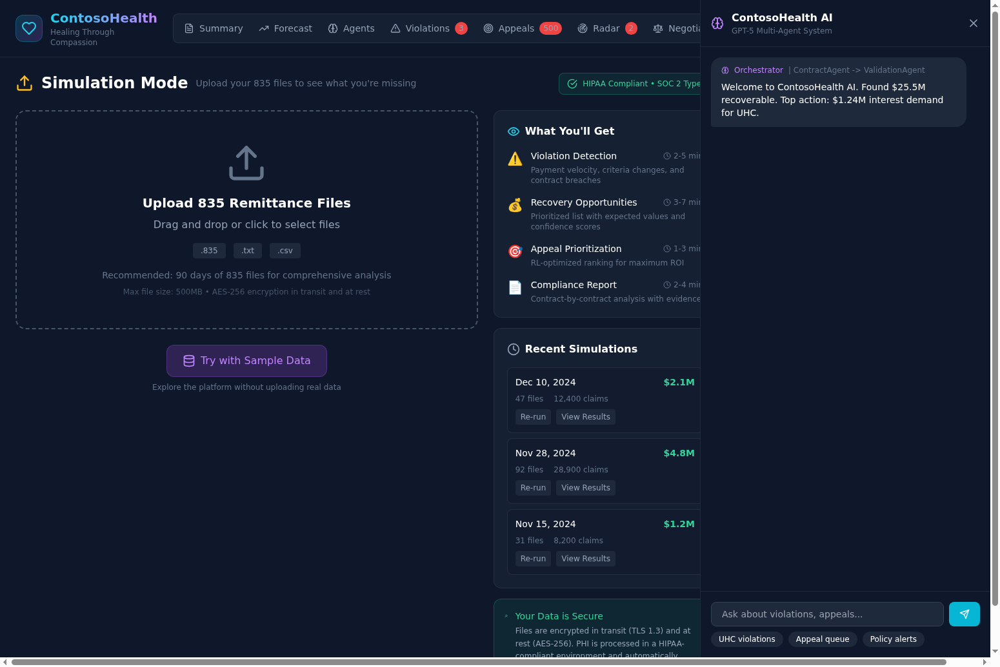

# ContosoHealth CFO Payer Response Platform

**"Healing Through Compassion"**

A comprehensive AI-powered healthcare revenue cycle management platform that helps providers identify contract violations, optimize appeals, predict policy changes, and negotiate better payer contracts. Built for CFOs who need actionable intelligence with full transparency and audit trails.

---

## Part 1: Executive Summary & Functionality

### Platform Overview

The CFO Payer Warfare Platform is designed for healthcare CFOs and revenue cycle teams to maximize revenue recovery from commercial and government payers. The platform combines real-time claims data analysis with multi-agent AI orchestration to identify actionable opportunities worth millions in recoverable revenue.

### Key Metrics

| Metric | Value |
|--------|-------|
| Total Recoverable | $25.5M |
| Active Violations | 3 |
| Pending Appeals | 500 |
| Policy Alerts | 2 |
| AI Prediction Accuracy | 96% vs 78% industry avg |
| AI Agents | 12 specialized agents |

### Supported Payers

The platform provides healthcare providers with tools to manage payer relationships across six major insurers:

| Payer | Type | Annual Revenue | Risk Tier |
|-------|------|----------------|-----------|
| UHC MA | Medicare Advantage | $856.8M | Critical |
| Humana MA | Medicare Advantage | $623.4M | High |
| FL Blue | Commercial | $712.3M | Elevated |
| Aetna | Commercial | $445.2M | Moderate |
| Cigna | Commercial | $334.1M | Normal |
| Medicare | Government | $892.5M | Normal |

---

### 1. Summary Dashboard

The main dashboard provides a consolidated view of all recoverable revenue opportunities with CFO-grade transparency.


**Key Features:**
- **Total Recoverable Banner**: Shows $25.5M total with breakdown by confidence tier ($18.1M high, $5.1M medium, $2.3M needs review)
- **AI Discovery Summary**: Compares manual audit (4 violations, $1.2M) vs AI analysis (23 violations, $6.0M) - 475% more found in 47 minutes vs 12 days
- **Payer Analytics**: Dynamic charts that update based on payer selection:
  - Yield Trend: 6-month payment yield visualization with color-coded bars
  - Denials: Breakdown by category (Medical Necessity, Prior Auth, Coding Errors, Timely Filing)
  - Payer Summary: Revenue, yield gap, and risk tier
  - Cash Forecast: Projected vs actual collections
- **Priority Actions**: Top violations ranked by recoverable amount with one-click demand letter generation
- **Human-in-the-Loop Approval**: Actions over $10K require manager approval, over $50K require executive approval

---

### 2. Contract Violations

The Violations tab provides detailed analysis of each identified contract breach with supporting evidence and CFO-grade confidence metrics.


**Key Features:**
- **Violation Cards**: Each shows payer, CARC code, amount, win probability, expected value, and days since detection
- **Confidence Scores**: Sample size displayed (e.g., "94% conf (n=4,247)") for statistical credibility
- **Interest Calculation**: Transparent methodology with expandable calculation details
- **Evidence Preview**: Quick view of supporting documentation before sending demand letters
- **Urgency Indicators**: Days remaining before statute of limitations
- **Export Button**: Download violation data for audit trails
- **Approval Workflow**: High-value demands require appropriate approval level

---

### 3. Appeal ROI Optimizer

The Appeals tab uses machine learning to prioritize denied claims by expected recovery value rather than simple FIFO processing.


**Key Features:**
- **Win Rate Analysis**: Historical win rates by CARC code with sample sizes:
  - CO-16 Missing Info: 78% +/-6% (n=1,247)
  - CO-197 Prior Auth: 68% +/-8% (n=892)
  - OA-23 Medical Necessity: 52% +/-5% (n=2,156)
  - CO-97 Bundling: 45% +/-7% (n=634)
- **RL Optimizer**: Reinforcement learning identifies top 50 appeals with 78% win rate vs 45% FIFO ($180K improvement)
- **Prioritized Queue**: Claims ranked by Expected Value (Amount x Win Probability)
- **Bulk Actions**: One-click bulk appeal for top performers with approval workflow
- **Prediction Accuracy Badge**: Shows model accuracy vs industry benchmark
- **Last Reviewed Status**: Audit trail of when each appeal was last evaluated

---

### 4. Policy Change Radar

The Radar tab uses AI to predict upcoming payer policy changes 30-45 days before they take effect, giving providers time to prepare.


**Key Features:**
- **Signal Sources**: Four intelligence sources with clickable links:
  - Earnings Calls: NLP analysis of payer quarterly transcripts
  - Competitors: Tracking similar changes across payers
  - Bulletins: Payer provider bulletins and policy updates
  - Regulatory: CMS and state regulatory filings
- **Impact Calculation Modal**: Transparent methodology showing how impact is calculated
- **Preparation Progress Tracker**: Checklist showing completion status (e.g., "2/5 complete")
- **Urgency Indicators**: Days until implementation with color-coded urgency
- **Mitigation Strategies**: Recommended actions with ROI estimates

---

### 5. Negotiation Intelligence

The Negotiate tab provides data-driven insights for contract renewal negotiations with BATNA analysis.


**Key Features:**
- **Leverage Score Breakdown**: Visual breakdown of leverage components (violations, market position, volume)
- **Historical Negotiations**: Past negotiation outcomes with achievement percentage
- **BATNA Analysis**: Best Alternative to Negotiated Agreement with risk assessment
- **Rate Comparison**: Your rates vs market P50 benchmarks with annual dollar impact
- **AI Playbook**: Recommended positions with confidence levels:
  - Opening Position: Aggressive ask with rationale
  - Target: Realistic goal
  - Walk-Away: Minimum acceptable terms
- **Talking Points**: Priority-ranked negotiation points with supporting evidence

---

### 6. Model Performance / Backtesting

The Performance tab provides transparency into AI model accuracy with industry benchmarks and drill-down capability.



**Key Features:**
- **Accuracy Metrics**: 96% +/-2% accuracy (n=8,412) vs 78% industry average (+18% improvement)
- **Trend Indicators**: Improving/declining accuracy trends over time
- **Monthly Breakdown**: Predicted vs actual recovery by month with drill-down capability
- **CARC Code Accuracy**: Performance breakdown by denial type
- **Payer Accuracy**: Performance breakdown by payer
- **Cost Breakdown Modal**: Staff $98K, Legal $25K, Systems $15K
- **Export Button**: Download performance data for audit trail
- **Date Range Filter**: Analyze specific time periods

---

### 7. Simulation Mode

The Simulate tab allows CFOs to upload historical 835 remittance files and see what revenue was missed.



**Key Features:**
- **File Format Specs**: Accepts .835, .txt, .csv files up to 500MB
- **Sample Data Button**: Load demo data to see capabilities
- **"What You'll Get" Preview**: Shows deliverables before running simulation:
  - Missed violations with dollar amounts
  - Appeal opportunities ranked by ROI
  - Policy change predictions
  - Negotiation leverage analysis
- **Recent Simulations**: History of past simulations with results
- **HIPAA Compliance Badge**: Confirms data handling compliance
- **Upload Progress States**: Validating -> Processing -> Complete with status indicators

---

### AI Chat Assistant

The platform includes a GPT-5 powered chat assistant accessible from any tab. The AI system uses a 12-agent architecture:

| Agent | Purpose |
|-------|---------|
| Orchestrator | Routes queries to appropriate agents |
| Contract Agent | Contract analysis and violation detection |
| Claims Agent | Claims data analysis |
| Policy Agent | Policy monitoring and prediction |
| Appeal Agent | Appeal strategy and win rate prediction |
| Negotiation Agent | Negotiation strategy and leverage analysis |
| Regulatory Agent | Regulatory compliance monitoring |
| Validation Agent | Cross-agent validation |
| Reasoning Agent | Complex calculations and chain-of-thought |
| SpotCheck Agent | 5% random sampling verification |
| Aggregation Agent | Sum integrity and bounds checking |
| Evidence Agent | Evidence package compilation |

---

### 5-Layer Validation Framework

The platform implements a comprehensive validation framework for CFO-grade reliability:

1. **Self-Validation**: Each agent output includes confidence score, sample size, and validation checks
2. **Cross-Agent Validation**: Consensus rules requiring 2+ agents to agree on high-stakes decisions
3. **Spot-Check Framework**: 5% random sampling with o4-mini model for independent verification
4. **Aggregation Validation**: Sum integrity, confidence tier sums, count integrity, historical bounds
5. **Human-in-the-Loop**: Approval queue for actions exceeding thresholds

**Approval Thresholds:**

| Action Type | Auto-Approve | Manager | Executive | Legal |
|-------------|--------------|---------|-----------|-------|
| Demand Letters | <$10K | $10K-$50K | $50K-$100K | >$100K |
| Bulk Appeals | <50 claims | 50-100 | 100-200 | >200 |
| Negotiations | <10% ask | 10-15% | 15-25% | >25% |

---

## Part 2: Addendum - Installation Instructions

### Prerequisites

- Python 3.11 or higher
- Node.js 18 or higher
- npm 9 or higher
- Git

### Step 1: Clone the Repository

```bash
git clone https://github.com/gregnatkatz/cfoprovider.git
cd cfoprovider
```

### Step 2: Backend Setup

#### 2.1 Create Python Virtual Environment

```bash
cd backend

# Create virtual environment
python3 -m venv venv

# Activate virtual environment
# On macOS/Linux:
source venv/bin/activate

# On Windows:
# venv\Scripts\activate
```

#### 2.2 Install Poetry (if not already installed)

```bash
pip install poetry
```

#### 2.3 Install Backend Dependencies

```bash
poetry install
```

#### 2.4 Configure Environment Variables

Create a `.env` file in the `backend` directory:

```bash
# Azure OpenAI Configuration (Required)
AZURE_OPENAI_ENDPOINT=https://your-resource.openai.azure.com/
AZURE_OPENAI_API_KEY=your-api-key-here
AZURE_OPENAI_DEPLOYMENT=gpt-5

# Azure AI Search Configuration (Optional - for RAG)
AZURE_SEARCH_ENDPOINT=https://your-search.search.windows.net
AZURE_SEARCH_API_KEY=your-search-key
AZURE_SEARCH_INDEX=warfarecfo

# Database Configuration (Optional - defaults to SQLite)
DATABASE_URL=sqlite:///./claims_data/sqlite/claims.db
```

#### 2.5 Initialize the Database

The database is pre-populated with synthetic claims data. If you need to regenerate:

```bash
poetry run python generate_warfare_data.py
```

#### 2.6 Run the Backend Server

```bash
poetry run uvicorn app.main:app --reload --host 0.0.0.0 --port 8000
```

The backend will be available at `http://localhost:8000`

You can verify it's running by visiting `http://localhost:8000/docs` for the API documentation.

### Step 3: Frontend Setup

Open a new terminal window and navigate to the frontend directory:

#### 3.1 Navigate to Frontend Directory

```bash
cd cfo-frontend
```

#### 3.2 Install Node Dependencies

```bash
npm install
```

#### 3.3 Configure Environment Variables

Create a `.env` file in the `cfo-frontend` directory:

```bash
# Backend API URL
VITE_API_URL=http://localhost:8000
```

For production deployment, update this to your deployed backend URL.

#### 3.4 Run the Frontend Development Server

```bash
npm run dev
```

The frontend will be available at `http://localhost:5173`

### Step 4: Verify Installation

1. Open your browser to `http://localhost:5173`
2. You should see the ContosoHealth CFO Payer Warfare Platform
3. The Summary tab should display $25.5M recoverable
4. Select different payers from the dropdown to see dynamic chart updates
5. Try the AI Chat by clicking "AI Chat" and asking "What are the UHC violations?"

### Step 5: Production Build

#### Frontend Production Build

```bash
cd cfo-frontend
npm run build
```

The production build will be in the `dist` directory.

#### Backend Production Deployment

The backend is configured for deployment on Fly.io:

```bash
cd backend
fly deploy
```

### Troubleshooting

**Issue: Backend fails to start**
- Ensure Python 3.11+ is installed: `python3 --version`
- Ensure virtual environment is activated: `which python` should show venv path
- Check `.env` file exists with valid Azure OpenAI credentials

**Issue: Frontend fails to connect to backend**
- Ensure backend is running on port 8000
- Check `VITE_API_URL` in frontend `.env` matches backend URL
- Check browser console for CORS errors

**Issue: AI Chat returns errors**
- Verify Azure OpenAI credentials are correct
- Check backend logs for API errors
- Ensure deployment name matches your Azure OpenAI deployment

**Issue: Charts show no data**
- Ensure database file exists at `backend/claims_data/sqlite/claims.db`
- Run `poetry run python generate_warfare_data.py` to regenerate data

---

## API Reference

### Core Endpoints

| Endpoint | Method | Description |
|----------|--------|-------------|
| `/api/payers` | GET | List all payers |
| `/api/analysis/payer/{id}` | GET | Payer-specific analytics |
| `/api/analysis/yield-trend` | GET | Overall yield trend |
| `/api/analysis/denial-breakdown` | GET | Denial breakdown |
| `/api/warfare/violations` | GET | Contract violations |
| `/api/warfare/appeals` | GET | Appeal queue |
| `/api/warfare/radar` | GET | Policy radar alerts |
| `/api/warfare/negotiation` | GET | Negotiation intelligence |
| `/api/warfare/chat` | POST | AI chat endpoint |

### Validation Endpoints

| Endpoint | Method | Description |
|----------|--------|-------------|
| `/api/validate/violation` | POST | Cross-agent violation validation |
| `/api/validate/appeal` | POST | Appeal validation |
| `/api/validate/spot-check` | POST | 5% random sampling |
| `/api/approval-queue` | GET | Human-in-the-loop queue |
| `/api/validation-framework/status` | GET | Framework status |

---

## Contributing

This project is maintained by Gregory Katz. For questions or contributions, please open an issue or pull request on GitHub.

## License

Proprietary - ContosoHealth Internal Use Only
